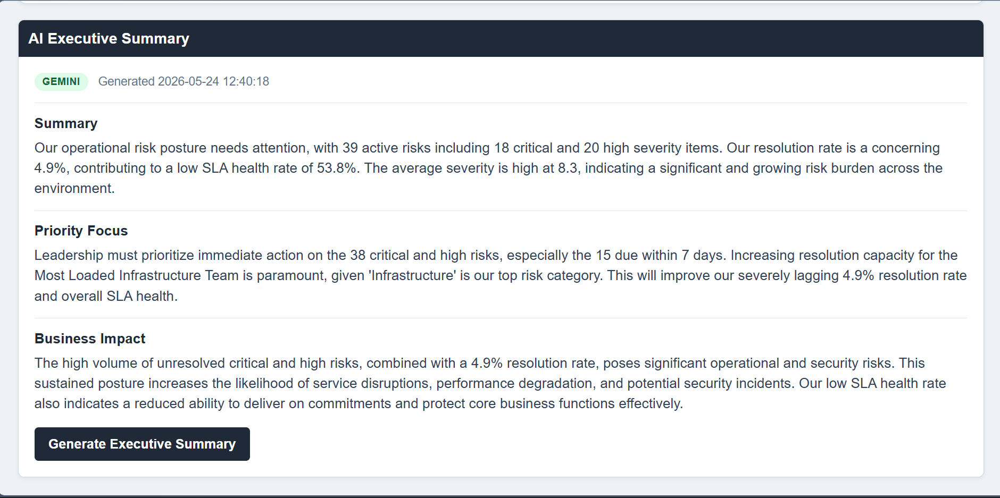
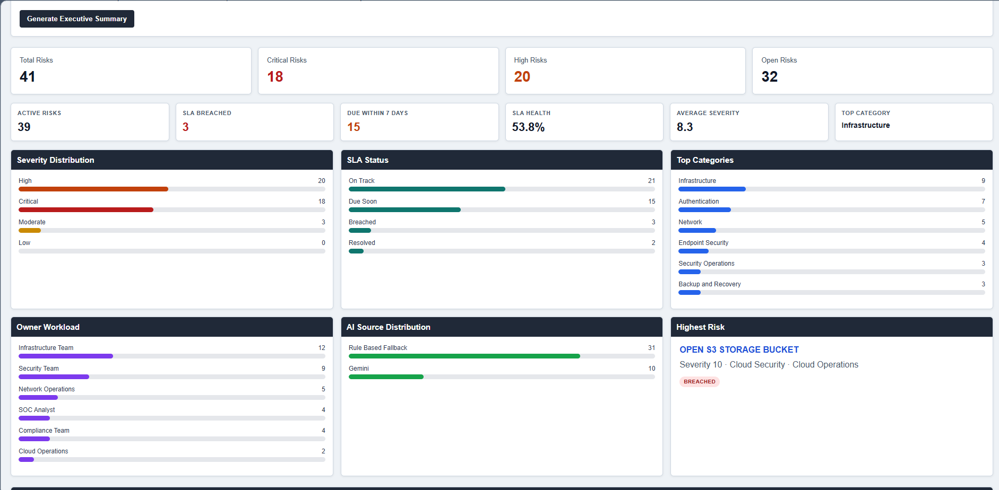
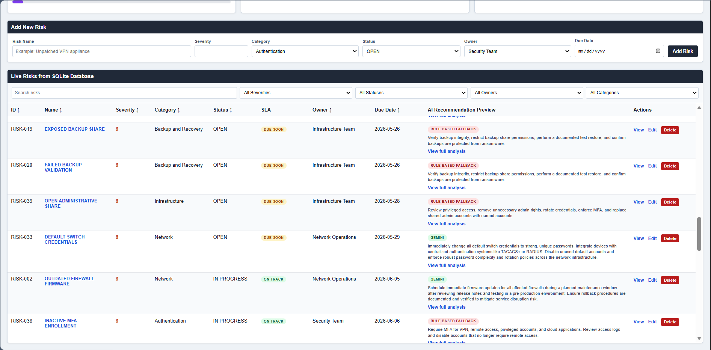
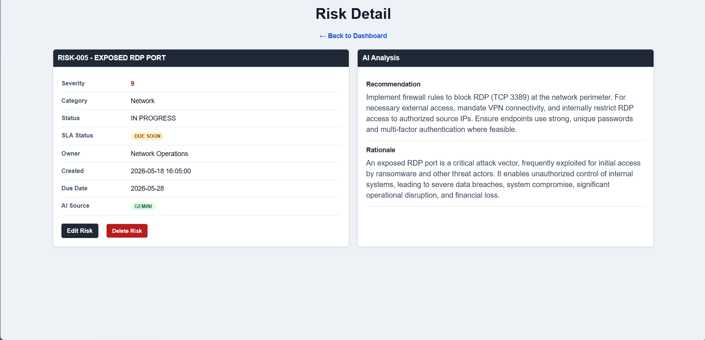
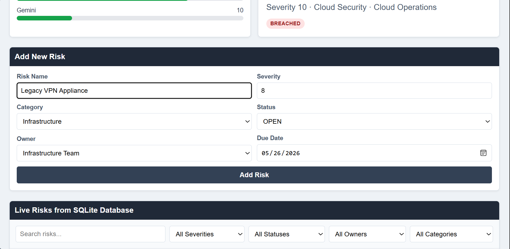

# AI Operations Assistant

AI-assisted operational risk management platform built with Flask and SQLite. The application supports operational risk tracking, remediation coordination, CRUD workflows, AI-generated remediation recommendations, executive summaries, SLA monitoring, and dashboard-based reporting.

This project demonstrates Python web development, SQLite-backed data persistence, AI provider integration, operational dashboard design, and security/risk management workflows.

---

## Current Flask Dashboard


---

## Features

- Flask-based web dashboard
- SQLite-backed risk database
- Add, edit, view, and delete risk records
- AI-generated remediation recommendations
- AI-generated executive summaries
- Gemini → OpenAI → rule-based fallback logic
- Local rule-based recommendation engine
- SLA status tracking
- Breached and due-soon risk visibility
- Risk detail pages with recommendation and rationale
- Search and filter workflow
- Executive dashboard metrics
- AI source tracking
- Secure `.env` API key handling

---

## AI Executive Summary



---

## SLA Metrics and Operational Charts



---

## Risk Table with Recommendation Preview



---

## Risk Detail Page



---

## Add Risk Workflow



---

## Technologies Used

- Python
- Flask
- SQLite
- HTML
- CSS
- Jinja2
- Google Gemini API
- OpenAI API
- python-dotenv
- Git / GitHub

---

## AI Provider Logic

The platform uses a provider fallback model:

1. Google Gemini
2. OpenAI
3. Local rule-based fallback engine

If an AI provider is unavailable, rate-limited, missing a key, or fails to return valid JSON, the app continues working by falling back to the next available option.

---

## Project Structure

```text
ai-operations-assistant/
├── app.py
├── ai_engine.py
├── risks.db
├── risks.csv
├── risk_summary.py
├── risk_report.md
├── risk_report.txt
├── README.md
├── .env.example
├── .gitignore
│
├── templates/
│   ├── dashboard.html
│   ├── risk_detail.html
│   ├── edit_risk.html
│   └── dashboard_template.html
│
├── static/
│   └── styles.css
│
├── screenshots/
│   ├── current/
│   └── archive/
│
└── charts/