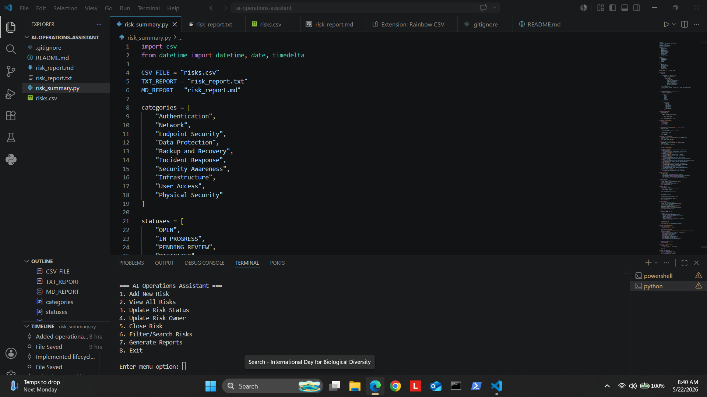
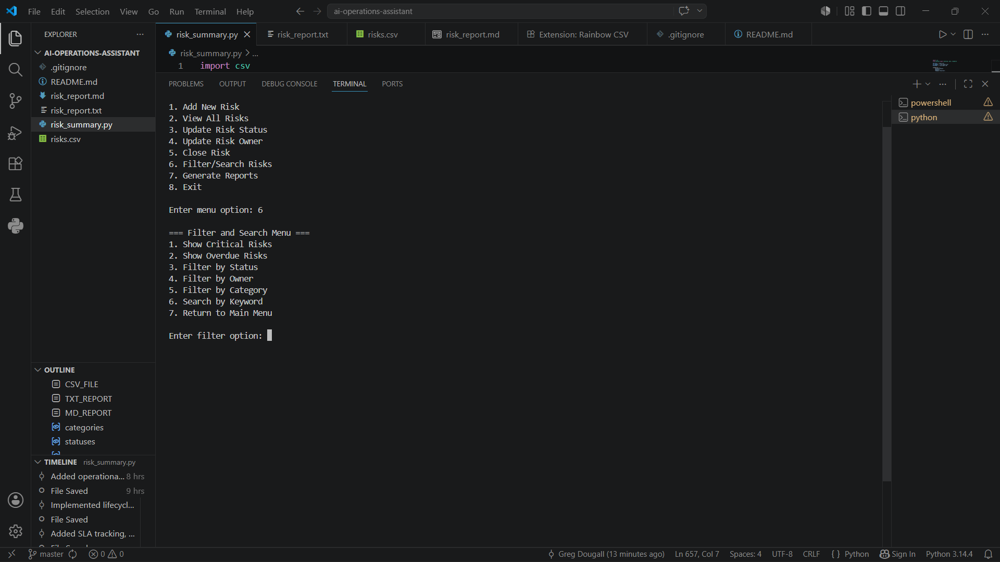
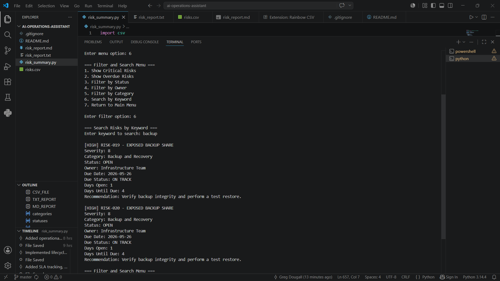
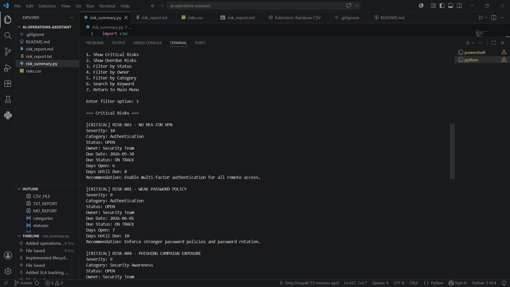
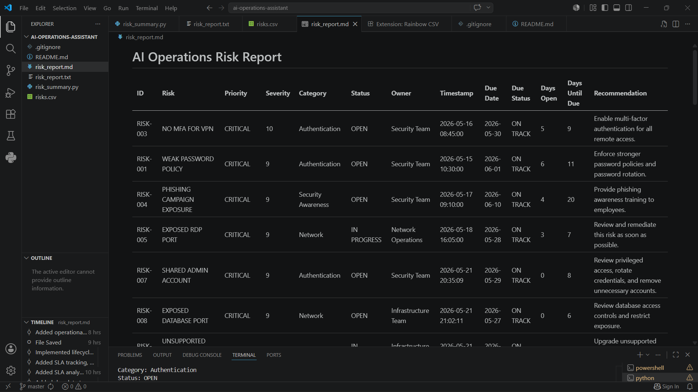
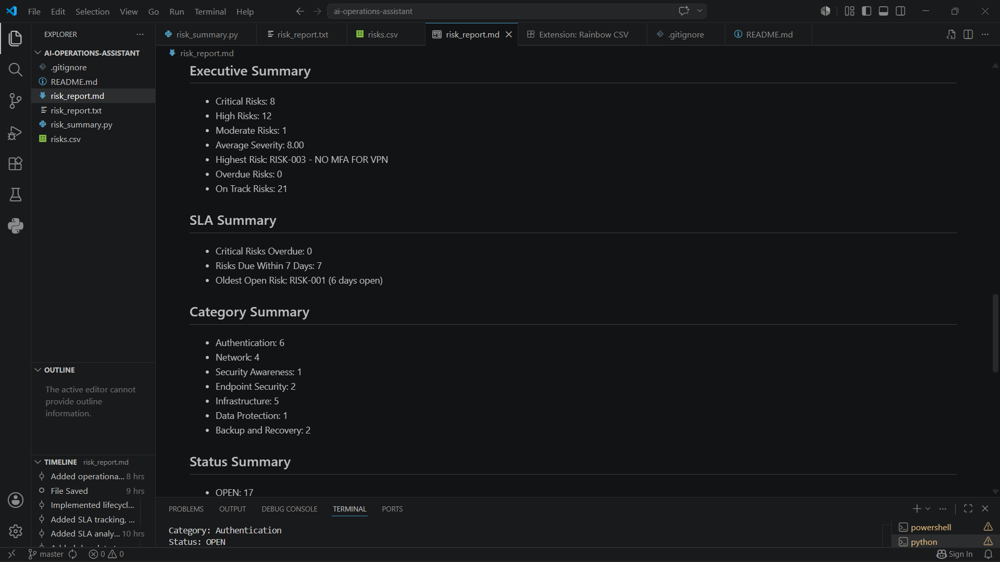
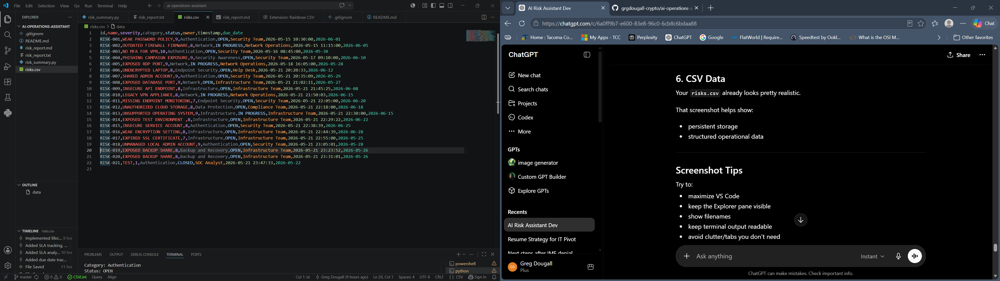

# AI Operations Assistant

AI-assisted operational risk management platform built with Flask and SQLite. The application supports operational risk tracking, remediation coordination, CRUD workflows, AI-inspired remediation analysis, dynamic dashboards, reporting automation, and modular Python architecture designed for future AI integration.

This project simulates real-world operational workflows commonly found in:
- security operations
- governance/risk/compliance (GRC)
- remediation coordination
- operational governance tooling
- IT operations management
- AI-assisted operational platforms

---

# Features

## Current Capabilities

### Operational Risk Management
- Browser-based risk management workflows
- Create new operational/security risks
- Edit existing risks
- Delete risks
- Risk lifecycle management
- Risk owner reassignment
- Risk closure workflows
- Severity-based priority calculation
- SLA monitoring and due-date tracking
- Risk aging metrics
- Category and status management
- Persistent SQLite storage

### AI-Inspired Analysis Engine
- AI-style remediation recommendations
- AI-generated operational rationale
- Keyword-based operational analysis
- Category-aware recommendation logic
- Severity-aware priority analysis
- Modular AI analysis layer (`ai_engine.py`)

### Interactive Dashboard
- Flask web application
- Live KPI cards
- Dynamic filtering and sorting
- Search functionality
- Severity filtering
- Status filtering
- Owner filtering
- Category filtering
- Responsive operational dashboard

### Reporting and Persistence
- TXT report generation
- Markdown report generation
- CSV export and persistence workflows
- SQLite database backend
- Persistent risk storage
- Queryable operational data

---

# Operational Workflow

The platform currently supports the following workflow:

1. Add new operational/security risks
2. Generate AI-inspired recommendations and rationale
3. View operational dashboards
4. Edit and update risks
5. Reassign risk ownership
6. Track remediation status
7. Filter/search operational risks
8. Generate operational reports
9. Delete or close risks
10. Persist operational data to SQLite

---

# Example Risk Categories

- Authentication
- Network
- Endpoint Security
- Data Protection
- Backup and Recovery
- Incident Response
- Security Awareness
- Infrastructure
- User Access
- Physical Security
- Cloud Security
- Security Operations
- Governance
- Compliance
- Identity and Access

---

# Example Risk Types

- Weak password policy
- Exposed RDP services
- Unsupported operating systems
- Expired SSL certificates
- Public-facing insecure APIs
- Backup share exposure
- Missing MFA enforcement
- Phishing susceptibility
- Firewall misconfiguration
- Unpatched VPN appliances
- Cloud storage exposure
- Weak endpoint protection

---

# AI Analysis Engine

The platform includes a dedicated AI-style analysis layer located in:

```text
ai_engine.py
```

The AI engine currently provides:
- remediation recommendations
- operational rationale generation
- keyword-based analysis
- severity-aware prioritization
- recommendation scoring logic

The architecture is intentionally modular to support future integration with:
- OpenAI APIs
- Ollama
- LangChain
- local LLMs
- Retrieval-Augmented Generation (RAG)
- vector databases
- automated operational workflows

---

# Example AI Analysis

## Risk

```text
Unpatched VPN appliance exposed to internet
```

## Generated Recommendation

```text
Prioritize patching based on severity, validate the affected asset, confirm maintenance windows, apply updates, and rescan to verify remediation.
```

## Generated Rationale

```text
Critical priority: Unpatched systems increase the likelihood of exploitation, especially when vulnerabilities are public or actively targeted.
```

---

# Generated Reports

The platform currently generates:

## TXT Executive Report

Includes:
- risk summaries
- SLA metrics
- overdue risks
- owner statistics
- category summaries
- operational metrics

## Markdown Risk Report

Includes:
- formatted risk tables
- operational summaries
- lifecycle tracking
- executive reporting sections

---

# Technologies Used

- Python
- Flask
- SQLite
- HTML5
- CSS3
- JavaScript
- Markdown
- CSV
- VS Code
- Git
- GitHub

---

# Current Architecture

```text
ai-operations-assistant/
│
├── app.py
├── ai_engine.py
├── risks.db
├── risk_summary.py
├── templates/
│   ├── dashboard.html
│   └── edit_risk.html
├── static/
│   └── styles.css
├── screenshots/
├── charts/
├── risk_report.txt
├── risk_report.md
├── risks.csv
└── README.md
```

---

# Screenshots

## Flask Dashboard with AI Analysis

Browser-based operational dashboard with CRUD workflows, filtering, KPI tracking, and AI-inspired analysis.


---

## Main Menu (Legacy CLI Version)

The original operational CLI interface for interacting with the AI Operations Assistant.



---

## Filter and Search Menu

Operational filtering and search workflows for identifying risks by severity, owner, category, status, or keyword.



---

## Keyword Search Workflow

Example keyword-based operational risk search using the term `backup`.



---

## Critical Risk Output

Prioritized operational risk output showing severity, ownership, SLA metrics, and remediation recommendations.



---

## Markdown Risk Report

Automatically generated markdown-based operational risk reporting.



---

## Executive and SLA Summaries

Executive summary metrics including:
- severity distribution
- SLA tracking
- category summaries
- operational reporting metrics



---

## CSV Operational Data

Structured CSV-based operational risk storage and persistence.



---

# Implemented Milestones

## Completed Features
- CSV-based persistence
- SQLite integration
- Flask web application
- CRUD operational workflows
- Dynamic filtering and search
- AI-inspired recommendation engine
- AI rationale generation
- Modular AI architecture
- Reporting automation
- Interactive operational dashboard

---

# Future Roadmap

## Planned Enhancements
- Dynamic chart generation from SQLite
- Executive summary generation
- Risk aging and SLA dashboards
- Authentication and role-based access
- REST API endpoints
- OpenAI integration
- Automated ticket workflows
- Email alerting and escalation
- Operational trend analysis
- Cloud deployment

---

# Future Direction

This project is evolving toward a lightweight AI-assisted operational risk and remediation platform inspired by:
- GRC workflows
- security operations coordination
- remediation tracking systems
- operational governance tooling
- AI-assisted operational platforms
- project management workflows

Future roadmap concepts include:
- AI-assisted remediation guidance
- intelligent recommendation scoring
- dashboard analytics
- operational ticket integration
- authentication and role-based access
- LLM-assisted operational workflows
- automated operational coordination
- executive reporting automation

---

# Learning Objectives

This project demonstrates practical experience with:
- Flask application development
- SQLite database integration
- CRUD operational workflows
- modular Python architecture
- operational risk concepts
- frontend/backend integration
- AI-assisted workflow design
- security operations concepts
- operational analytics
- reporting automation

---

# Author

Greg Dougall

Tacoma Community College  
AAS Information Systems & Cybersecurity

GitHub:  
https://github.com/grgdougall-crypto