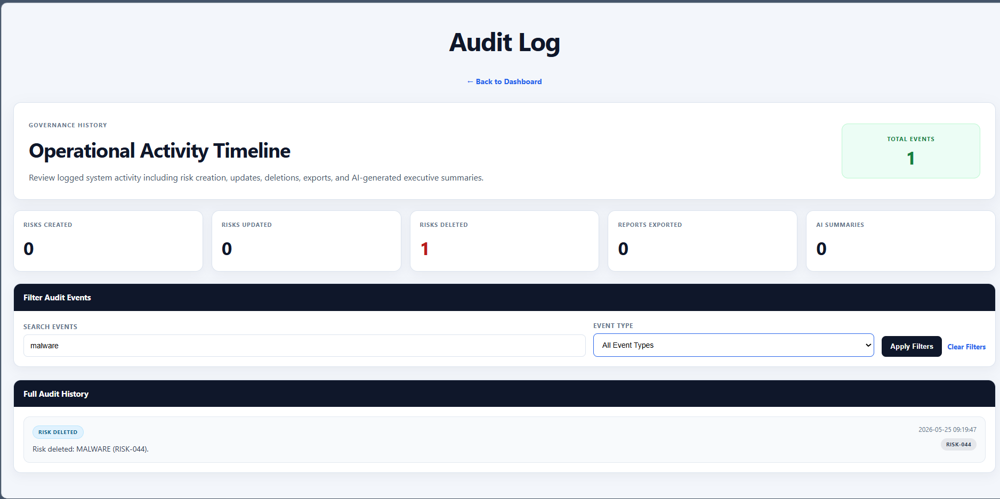

# AI Operations Risk Platform

An AI-assisted operational governance and risk management platform built with Flask, SQLite, Chart.js, and multi-provider AI integrations.

This project evolved from a simple CLI/CSV prototype into a dashboard-driven operational platform focused on:

- operational risk management
- governance visibility
- AI-assisted remediation workflows
- executive reporting
- audit logging
- SLA tracking
- analytics and operational KPIs

The platform simulates a realistic internal operations or security governance environment while remaining lightweight and beginner-friendly.

---

# Executive Dashboard Overview

The platform provides an executive dashboard focused on operational posture, SLA health, risk prioritization, workload visibility, and AI-generated reporting.

## Key Dashboard Capabilities

- Executive operational posture summaries
- AI-generated executive reporting
- Severity and SLA analytics
- Risk category distribution
- Team workload visibility
- AI source tracking
- Operational KPI monitoring
- Live SQLite-backed risk workflows
- Audit history and governance visibility

---

# Screenshots

## Executive Dashboard Overview


The executive dashboard provides a high-level operational posture summary including risk exposure, SLA health, AI-generated reporting, and export capabilities.

---

## Operational Analytics


Operational analytics panels provide visibility into:

- severity distribution
- SLA performance
- risk category concentration
- owner workload
- AI provider usage
- highest-priority operational risks

---

## Risk Management Workflow


The operational workflow layer includes:

- risk creation
- status management
- SLA tracking
- filtering and search
- AI-generated remediation previews
- operational ownership assignment

---

## AI-Assisted Risk Analysis


Each risk contains detailed AI-assisted remediation guidance including:

- recommendations
- rationale
- AI provider attribution
- operational metadata
- lifecycle tracking

---

## Audit Log Overview


The governance layer includes a centralized audit log system for tracking:

- risk creation
- updates
- deletions
- exports
- executive summary generation
- operational activity history

---

## Audit Filtering and Search



Audit filtering and search capabilities allow operational review and governance traceability across historical events.

---

## Reporting and Export Features


The platform supports operational reporting exports including:

- CSV portfolio exports
- Executive markdown reports
- offline operational analysis
- management-ready reporting workflows

---

## Architecture Documentation


The project includes architecture documentation and operational workflow diagrams using Mermaid.

---

# Core Features

## AI Recommendation Engine

The platform uses a multi-stage fallback AI architecture:

1. Gemini API
2. OpenAI API
3. Local rule-based fallback engine

This architecture allows the platform to continue functioning even if external AI providers become unavailable.

### AI Features

- AI-generated remediation recommendations
- AI-generated rationale summaries
- AI-generated executive reporting
- AI source attribution
- operational fallback resilience

---

## Operational Governance Features

### SLA Tracking

Risks are automatically categorized into:

- On Track
- Due Soon
- Breached
- Resolved

### Audit Logging

The platform maintains a centralized audit trail for:

- risk lifecycle events
- exports
- executive report generation
- operational workflow activity

### Executive Reporting

The dashboard provides:

- operational posture summaries
- KPI metrics
- workload distribution
- severity analytics
- SLA visibility
- executive narrative summaries

---

# Technology Stack

## Backend

- Python
- Flask
- SQLite

## Frontend

- HTML
- CSS
- Jinja2 Templates
- Chart.js

## AI Integrations

- Gemini API
- OpenAI API
- Local Rule-Based Fallback Engine

## Reporting

- CSV Exports
- Markdown Executive Reports

---

# Project Architecture

Architecture documentation is included in the `/documentation` directory.

## Included Documentation

- System architecture diagram
- AI fallback flow diagram
- Operational workflow diagram

### Documentation Files

```text
/documentation
├── architecture-diagram.md
├── ai-fallback-flow.md
└── operational-workflow.md
```

---

# Repository Structure

```text
ai-operations-assistant/
├── documentation/
├── screenshots/
│   ├── current/
│   └── archive/
├── static/
├── templates/
├── app.py
├── ai_engine.py
├── requirements.txt
├── README.md
└── LICENSE
```

---

# Current Capabilities

## Operational Analytics

- Executive KPI dashboards
- Severity tracking
- SLA monitoring
- Owner workload analysis
- AI source analytics

## Risk Workflows

- Create risks
- Update risk status
- Delete risks
- Search and filter risks
- Risk detail analysis

## Reporting

- CSV exports
- Markdown executive reports
- AI-generated summaries

## Governance

- Audit logging
- Activity tracking
- Event filtering
- Operational traceability

---

# Future Roadmap

Planned future enhancements include:

- PostgreSQL migration
- public deployment
- authentication and RBAC
- remediation aging analytics
- SLA forecasting
- workflow escalation logic
- Jira/ServiceNow-style workflow simulation
- enhanced AI remediation intelligence
- historical trend analytics
- deployment automation

---

# Deployment Goals

Planned deployment targets include:

- Render
- Railway
- Fly.io

Future deployment goals include:

- public demo environment
- production-style environment variables
- PostgreSQL backend migration
- persistent hosted database

---

# Portfolio Goals

This project was designed to demonstrate:

- Flask application development
- operational governance concepts
- cybersecurity risk workflows
- AI-assisted operational tooling
- dashboard analytics
- SQLite persistence
- architecture documentation
- reporting and export pipelines
- audit logging systems
- responsive frontend design

---

# License

This project is licensed under the MIT License.