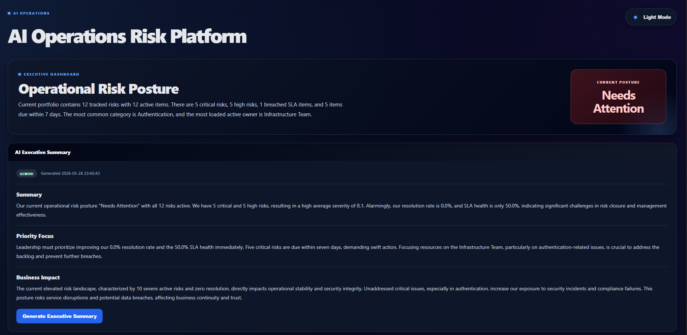
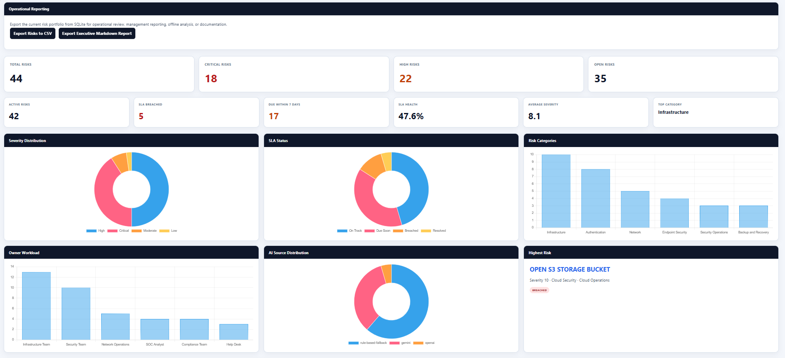
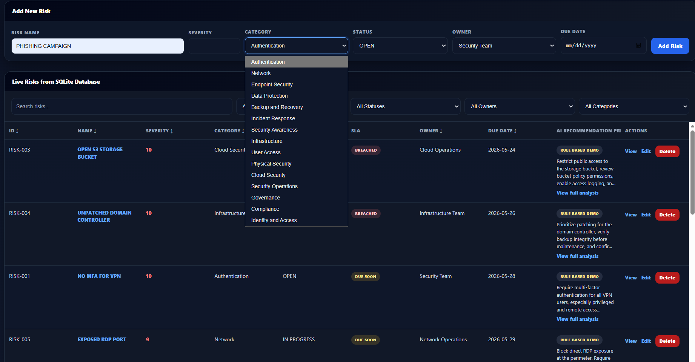
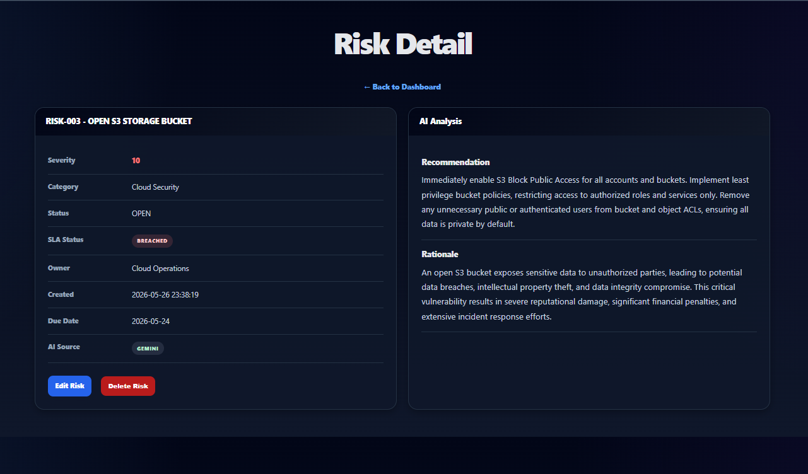
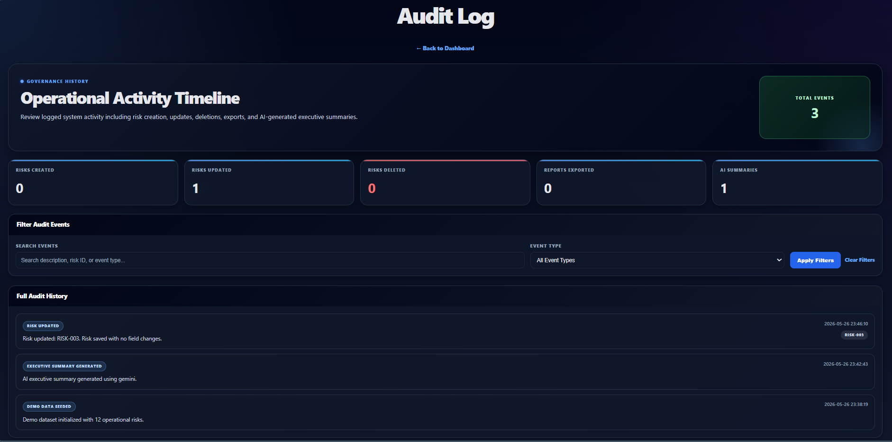
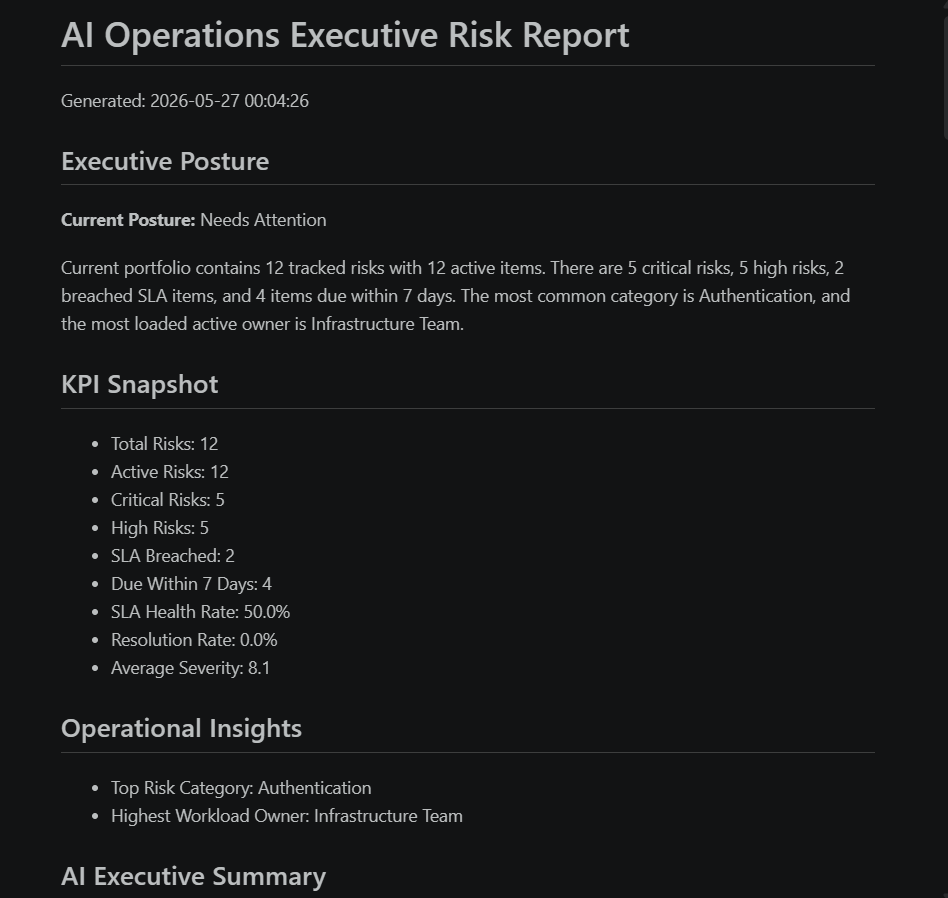
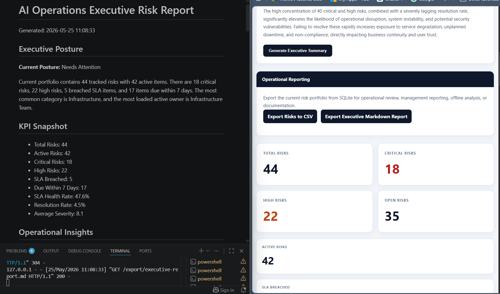
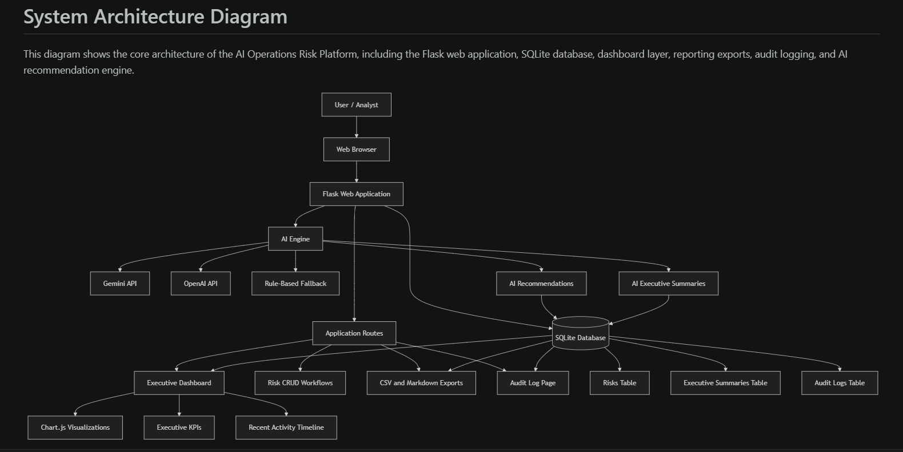
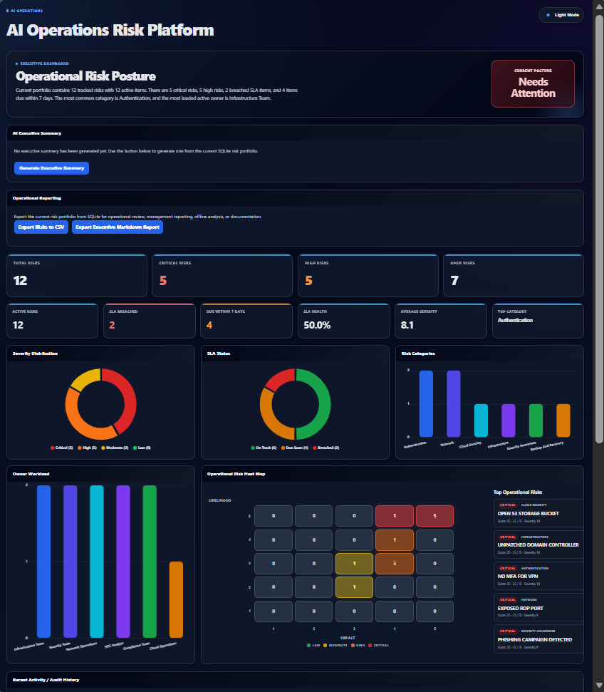

# AI Operations Assistant


AI-powered operational risk management and executive reporting platform built with Flask, SQLite, HTML/CSS, and AI-assisted remediation workflows.

The platform uses AI assistance to generate remediation recommendations, explain operational risk rationale, and create executive-ready summaries from the active risk portfolio. AI outputs include source attribution and fallback handling between Gemini, OpenAI, and a local rule-based recommendation engine.

Designed as a portfolio-ready operations platform prototype focused on:

- operational risk visibility
- executive reporting
- SLA monitoring
- workflow coordination
- audit logging
- analytics and operational governance
- AI-assisted operational analysis

---

## Live Deployment

Deployed on Render:

https://ai-operations-assistant-5o3p.onrender.com

> Render free-tier deployments may take 30–60 seconds to wake after inactivity.

---

## Dashboard Overview



Modern executive dashboard for operational risk visibility, SLA monitoring, audit tracking, and executive reporting.

---

## Operational Analytics



Features include:

- Operational KPI monitoring
- SLA health tracking
- Risk severity distribution
- Risk category analytics
- Owner workload visualization
- Operational heat map analysis

---

## Risk Management Workflow



Workflow capabilities include:

- Risk creation and editing
- Severity scoring
- SLA assignment and monitoring
- Recommendation management
- Operational ownership tracking

---

## AI-Assisted Risk Analysis



Each operational risk contains AI-assisted analysis including:

- remediation recommendations
- rationale explanations
- business impact analysis
- operational metadata
- lifecycle tracking
- AI provider attribution

AI recommendations are generated through a multi-stage fallback workflow using Gemini, OpenAI, and local fallback logic.

---

## Audit Log Overview



Comprehensive audit logging system with:

- Risk activity history
- Export tracking
- Executive summary generation logging
- Operational workflow visibility

---

## Executive Markdown Reporting



Exportable executive-ready markdown reports containing:

- Executive posture summaries
- KPI snapshots
- Operational insights
- AI-generated executive analysis
- SLA and risk reporting

---

## Export & Reporting Features



Reporting functionality includes:

- CSV risk exports
- Executive markdown reports
- AI-assisted executive summaries
- Operational reporting workflows

---

## Architecture Documentation



Repository includes supporting operational documentation:

- System workflow documentation
- AI fallback architecture
- Operational workflow diagrams
- Project structure documentation

---

## Responsive Dashboard Layout



Responsive layout scaling for:

- Smaller displays
- Portable monitors
- Resized browser windows
- Flexible operational review workflows

---

## Technologies Used

### Backend

- Python
- Flask
- SQLite

### Frontend

- HTML5
- CSS3
- Jinja2
- Chart.js

### AI Integrations

- Gemini API
- OpenAI API
- Local Rule-Based Fallback Engine

### Deployment & Tooling

- Render
- GitHub
- Git

---

## Core Features

### AI-Assisted Operational Analysis

- AI-generated remediation recommendations
- AI-generated rationale summaries
- Executive operational summaries
- AI provider attribution
- Fallback AI resilience logic

### Operational Governance

- SLA monitoring
- Operational KPI dashboards
- Risk prioritization
- Owner workload visibility
- Operational heat map visualization

### Reporting & Auditability

- Audit logging
- CSV exports
- Executive markdown reports
- Operational reporting workflows
- Activity traceability

---

## Deployment Architecture

- Flask backend hosted on Render
- SQLite operational datastore
- Chart.js visualization layer
- Markdown executive reporting engine
- GitHub-integrated deployment workflow

---

## Repository Structure

```text
ai-operations-assistant/
│
├── documentation/
│   ├── ai-fallback-flow.md
│   ├── architecture-diagram.md
│   ├── operational-workflow.md
│   └── examples/
│       ├── risk_report.md
│       └── risk_report.txt
│
├── screenshots/
│   ├── archive/
│   └── current/
│
├── static/
├── templates/
│
├── app.py
├── ai_engine.py
├── risk_summary.py
├── requirements.txt
├── render.yaml
├── sample_risks.csv
└── README.md
```

---

## Future Improvements

Potential future enhancements:

- User authentication
- Role-based access control
- Risk trend forecasting
- AI remediation recommendations
- Database migration support
- PDF executive exports
- Real-time dashboard updates

---

## Portfolio Goals

This project was designed to demonstrate:

- Flask application development
- operational governance concepts
- cybersecurity risk workflows
- AI-assisted operational tooling
- dashboard analytics
- SQLite persistence
- architecture documentation
- reporting and export pipelines
- audit logging systems
- responsive frontend design

---

## License

This project is licensed under the MIT License.