# AI Operations Risk Report

## Executive KPI Dashboard

| KPI | Value |
|---|---:|
| Total Risks | 40 |
| Critical Risks | 17 |
| High Risks | 20 |
| Moderate Risks | 3 |
| Overdue Risks | 0 |
| On Track Risks | 38 |
| Risks Due Within 7 Days | 17 |
| SLA Compliance | 95.0% |
| Average Severity | 8.25 |
| Highest Risk | RISK-003 - NO MFA FOR VPN |
| Active Risks | 38 |
| Inactive Risks | 2 |
| Average Days Open - Active Risks | 2.3 |
| Most Common Risk Category | Infrastructure |

## Dashboard Charts

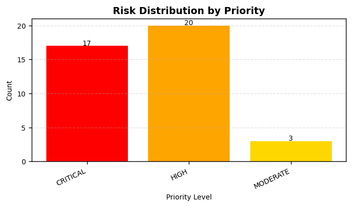

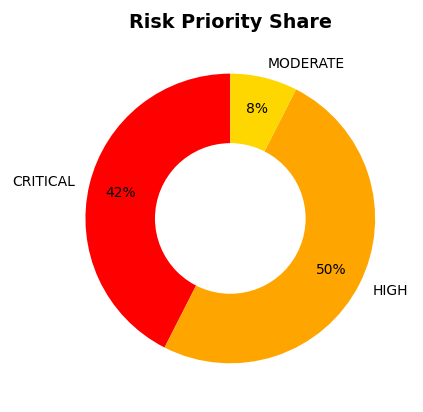

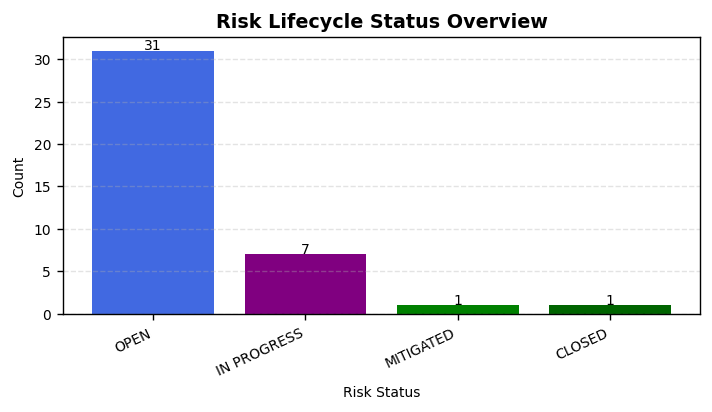

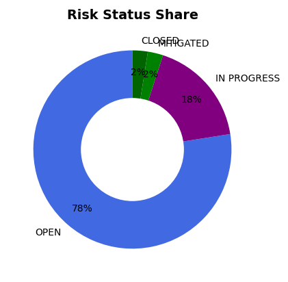

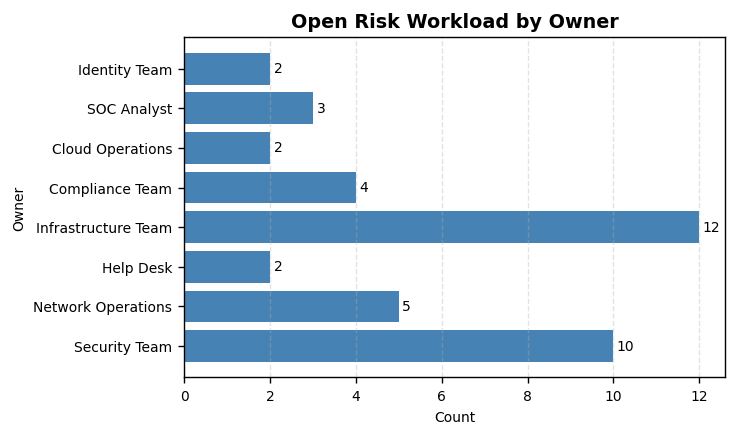

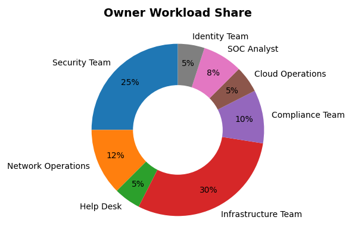

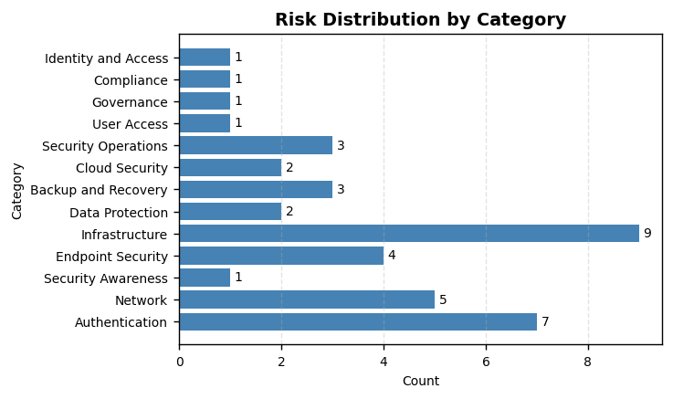

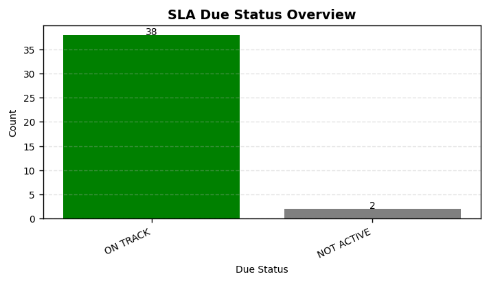

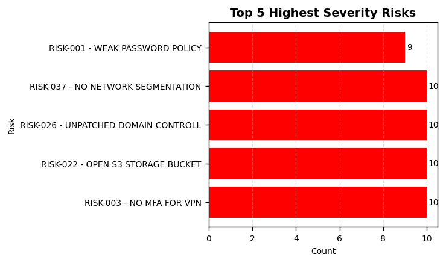

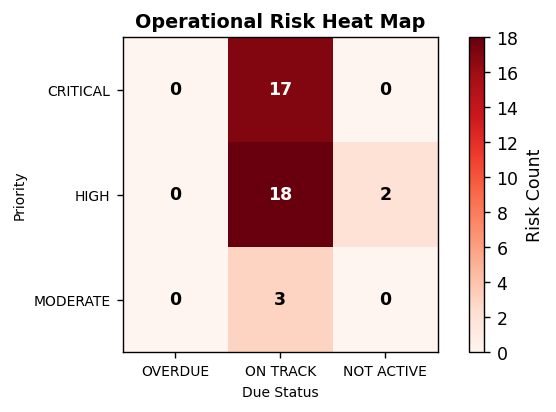

## Trend Analytics

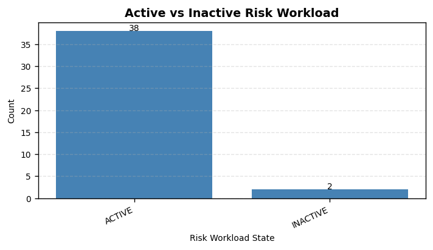

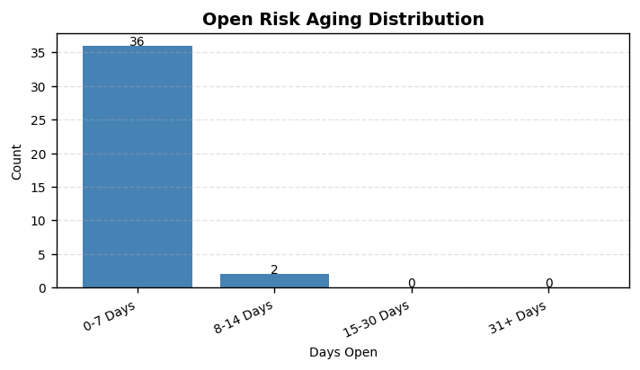

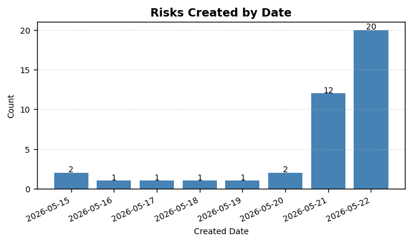

## Risk Detail Table

| ID | Risk | Priority | Severity | Category | Status | Owner | Timestamp | Due Date | Due Status | Days Open | Days Until Due | Recommendation |
|----|------|----------|----------|----------|--------|-------|------------|----------|------------|-----------|----------------|----------------|
| RISK-003 | NO MFA FOR VPN | CRITICAL | 10 | Authentication | OPEN | Security Team | 2026-05-16 08:45:00 | 2026-05-30 | ON TRACK | 7 | 7 | Require MFA for VPN, remote access, privileged accounts, and cloud applications. Review access logs and disable accounts that no longer require remote access. |
| RISK-022 | OPEN S3 STORAGE BUCKET | CRITICAL | 10 | Cloud Security | OPEN | Cloud Operations | 2026-05-22 08:15:00 | 2026-05-23 | ON TRACK | 1 | 0 | Review cloud permissions, disable public access where not required, enforce least privilege, enable logging, and validate configuration baselines. |
| RISK-026 | UNPATCHED DOMAIN CONTROLLER | CRITICAL | 10 | Infrastructure | OPEN | Infrastructure Team | 2026-05-22 12:05:00 | 2026-05-24 | ON TRACK | 1 | 1 | Review the risk, validate business impact, assign an owner, document remediation steps, and track progress until the risk is reduced or formally accepted. |
| RISK-037 | NO NETWORK SEGMENTATION | CRITICAL | 10 | Network | OPEN | Network Operations | 2026-05-22 21:00:00 | 2026-06-02 | ON TRACK | 1 | 10 | Review the risk, validate business impact, assign an owner, document remediation steps, and track progress until the risk is reduced or formally accepted. |
| RISK-001 | WEAK PASSWORD POLICY | CRITICAL | 9 | Authentication | OPEN | Security Team | 2026-05-15 10:30:00 | 2026-06-01 | ON TRACK | 8 | 9 | Enforce stronger password policies, require password length and complexity, enable account lockout protections, and review failed login activity. |
| RISK-004 | PHISHING CAMPAIGN EXPOSURE | CRITICAL | 9 | Security Awareness | OPEN | Security Team | 2026-05-17 09:10:00 | 2026-06-10 | ON TRACK | 6 | 18 | Provide phishing awareness training, enable email filtering, review reported messages, and run targeted simulations for high-risk user groups. |
| RISK-005 | EXPOSED RDP PORT | CRITICAL | 9 | Network | IN PROGRESS | Network Operations | 2026-05-18 16:05:00 | 2026-05-28 | ON TRACK | 5 | 5 | Disable public RDP exposure, restrict access through VPN or jump hosts, enforce MFA, and limit access to approved administrative users. |
| RISK-007 | SHARED ADMIN ACCOUNT | CRITICAL | 9 | Authentication | OPEN | Security Team | 2026-05-20 09:22:00 | 2026-05-29 | ON TRACK | 3 | 6 | Review privileged access, remove unnecessary admin rights, rotate credentials, enforce MFA, and replace shared admin accounts with named accounts. |
| RISK-008 | EXPOSED DATABASE PORT | CRITICAL | 9 | Infrastructure | OPEN | Infrastructure Team | 2026-05-20 14:05:00 | 2026-05-27 | ON TRACK | 3 | 4 | Restrict database access, review user permissions, disable public exposure, enforce encryption, and monitor for unauthorized queries. |
| RISK-013 | UNSUPPORTED OPERATING SYSTEM | CRITICAL | 9 | Infrastructure | IN PROGRESS | Infrastructure Team | 2026-05-21 20:10:00 | 2026-06-15 | ON TRACK | 2 | 23 | Upgrade unsupported systems, isolate legacy assets, apply compensating controls, and create a retirement or replacement plan. |
| RISK-018 | UNMANAGED LOCAL ADMIN ACCOUNT | CRITICAL | 9 | Authentication | OPEN | Security Team | 2026-05-21 23:05:01 | 2026-05-28 | ON TRACK | 2 | 5 | Review privileged access, remove unnecessary admin rights, rotate credentials, enforce MFA, and replace shared admin accounts with named accounts. |
| RISK-021 | DISABLED EDR AGENT | CRITICAL | 9 | Endpoint Security | OPEN | Security Team | 2026-05-22 07:45:00 | 2026-05-24 | ON TRACK | 1 | 1 | Verify endpoint protection, enable full-disk encryption, confirm patch compliance, and ensure the device is enrolled in centralized management. |
| RISK-023 | PRIVILEGE ESCALATION FINDING | CRITICAL | 9 | Infrastructure | IN PROGRESS | Infrastructure Team | 2026-05-22 09:45:00 | 2026-05-27 | ON TRACK | 1 | 4 | Review the risk, validate business impact, assign an owner, document remediation steps, and track progress until the risk is reduced or formally accepted. |
| RISK-025 | FAILED DISASTER RECOVERY TEST | CRITICAL | 9 | Backup and Recovery | OPEN | Infrastructure Team | 2026-05-22 11:00:00 | 2026-06-07 | ON TRACK | 1 | 15 | Verify backup integrity, restrict backup share permissions, perform a documented test restore, and confirm backups are protected from ransomware. |
| RISK-030 | SUSPICIOUS POWERSHELL ACTIVITY | CRITICAL | 9 | Security Operations | OPEN | SOC Analyst | 2026-05-22 15:20:00 | 2026-05-23 | ON TRACK | 1 | 0 | Review the risk, validate business impact, assign an owner, document remediation steps, and track progress until the risk is reduced or formally accepted. |
| RISK-036 | UNMONITORED PRIVILEGED ACCESS | CRITICAL | 9 | Identity and Access | OPEN | Identity Team | 2026-05-22 20:05:00 | 2026-05-30 | ON TRACK | 1 | 7 | Review privileged access, remove unnecessary admin rights, rotate credentials, enforce MFA, and replace shared admin accounts with named accounts. |
| RISK-040 | FAILED CLOUD COMPLIANCE AUDIT | CRITICAL | 9 | Cloud Security | OPEN | Cloud Operations | 2026-05-22 23:15:00 | 2026-06-05 | ON TRACK | 1 | 13 | Review cloud permissions, disable public access where not required, enforce least privilege, enable logging, and validate configuration baselines. |
| RISK-002 | OUTDATED FIREWALL FIRMWARE | HIGH | 8 | Network | IN PROGRESS | Network Operations | 2026-05-15 11:15:00 | 2026-06-05 | ON TRACK | 8 | 13 | Review firewall rules, remove unnecessary inbound access, restrict management ports, document approved exceptions, and verify firmware is current. |
| RISK-006 | UNENCRYPTED LAPTOP | HIGH | 8 | Endpoint Security | OPEN | Help Desk | 2026-05-19 12:40:00 | 2026-06-12 | ON TRACK | 4 | 20 | Verify endpoint protection, enable full-disk encryption, confirm patch compliance, and ensure the device is enrolled in centralized management. |
| RISK-009 | INSECURE API ENDPOINT | HIGH | 8 | Infrastructure | OPEN | Infrastructure Team | 2026-05-21 08:20:00 | 2026-06-08 | ON TRACK | 2 | 16 | Review API authentication, rotate exposed keys or tokens, restrict public access, validate rate limiting, and monitor API activity logs. |
| RISK-010 | LEGACY VPN APPLIANCE | HIGH | 8 | Network | IN PROGRESS | Network Operations | 2026-05-21 11:15:00 | 2026-06-15 | ON TRACK | 2 | 23 | Require MFA for VPN, remote access, privileged accounts, and cloud applications. Review access logs and disable accounts that no longer require remote access. |
| RISK-012 | UNAUTHORIZED CLOUD STORAGE | HIGH | 8 | Data Protection | OPEN | Compliance Team | 2026-05-21 18:45:00 | 2026-06-18 | ON TRACK | 2 | 26 | Review cloud permissions, disable public access where not required, enforce least privilege, enable logging, and validate configuration baselines. |
| RISK-014 | EXPOSED TEST ENVIRONMENT | HIGH | 8 | Infrastructure | OPEN | Infrastructure Team | 2026-05-21 22:29:22 | 2026-06-22 | ON TRACK | 2 | 30 | Review the risk, validate business impact, assign an owner, document remediation steps, and track progress until the risk is reduced or formally accepted. |
| RISK-015 | INSECURE SERVICE ACCOUNT | HIGH | 8 | Authentication | OPEN | Security Team | 2026-05-21 22:38:39 | 2026-06-25 | ON TRACK | 2 | 33 | Review the risk, validate business impact, assign an owner, document remediation steps, and track progress until the risk is reduced or formally accepted. |
| RISK-016 | WEAK ENCRYPTION SETTING | HIGH | 8 | Infrastructure | OPEN | Infrastructure Team | 2026-05-21 22:44:39 | 2026-06-28 | ON TRACK | 2 | 36 | Enable strong encryption, remove weak protocols, protect sensitive data at rest and in transit, and verify encryption settings through policy review. |
| RISK-019 | EXPOSED BACKUP SHARE | HIGH | 8 | Backup and Recovery | OPEN | Infrastructure Team | 2026-05-21 23:23:52 | 2026-05-26 | ON TRACK | 2 | 3 | Verify backup integrity, restrict backup share permissions, perform a documented test restore, and confirm backups are protected from ransomware. |
| RISK-020 | FAILED BACKUP VALIDATION | HIGH | 8 | Backup and Recovery | OPEN | Infrastructure Team | 2026-05-21 23:31:01 | 2026-05-26 | ON TRACK | 2 | 3 | Verify backup integrity, restrict backup share permissions, perform a documented test restore, and confirm backups are protected from ransomware. |
| RISK-024 | CRITICAL SIEM ALERTS UNREVIEWED | HIGH | 8 | Security Operations | OPEN | SOC Analyst | 2026-05-22 10:20:00 | 2026-05-23 | ON TRACK | 1 | 0 | Enable centralized logging, configure alerting for high-risk events, review monitoring coverage, and validate that alerts are assigned to an owner. |
| RISK-031 | NO EMAIL DLP CONTROLS | HIGH | 8 | Data Protection | OPEN | Compliance Team | 2026-05-22 16:10:00 | 2026-06-18 | ON TRACK | 1 | 26 | Provide phishing awareness training, enable email filtering, review reported messages, and run targeted simulations for high-risk user groups. |
| RISK-033 | DEFAULT SWITCH CREDENTIALS | HIGH | 8 | Network | OPEN | Network Operations | 2026-05-22 18:00:00 | 2026-05-29 | ON TRACK | 1 | 6 | Enforce stronger password policies, require password length and complexity, enable account lockout protections, and review failed login activity. |
| RISK-038 | INACTIVE MFA ENROLLMENT | HIGH | 8 | Authentication | IN PROGRESS | Security Team | 2026-05-22 21:50:00 | 2026-06-06 | ON TRACK | 1 | 14 | Require MFA for VPN, remote access, privileged accounts, and cloud applications. Review access logs and disable accounts that no longer require remote access. |
| RISK-039 | OPEN ADMINISTRATIVE SHARE | HIGH | 8 | Infrastructure | OPEN | Infrastructure Team | 2026-05-22 22:30:00 | 2026-05-28 | ON TRACK | 1 | 5 | Review privileged access, remove unnecessary admin rights, rotate credentials, enforce MFA, and replace shared admin accounts with named accounts. |
| RISK-011 | MISSING ENDPOINT MONITORING | HIGH | 7 | Endpoint Security | OPEN | Security Team | 2026-05-21 15:30:00 | 2026-06-20 | ON TRACK | 2 | 28 | Verify endpoint protection, enable full-disk encryption, confirm patch compliance, and ensure the device is enrolled in centralized management. |
| RISK-017 | EXPIRED SSL CERTIFICATE | HIGH | 7 | Infrastructure | OPEN | Infrastructure Team | 2026-05-21 22:55:00 | 2026-05-25 | ON TRACK | 2 | 2 | Renew expired certificates, verify TLS configuration, remove weak protocols, and document certificate ownership and renewal dates. |
| RISK-027 | EXCESSIVE USER PRIVILEGES | HIGH | 7 | User Access | MITIGATED | Identity Team | 2026-05-22 12:45:00 | 2026-06-03 | NOT ACTIVE | 1 | 11 | Review the risk, validate business impact, assign an owner, document remediation steps, and track progress until the risk is reduced or formally accepted. |
| RISK-029 | UNRESTRICTED USB STORAGE | HIGH | 7 | Endpoint Security | OPEN | Help Desk | 2026-05-22 14:30:00 | 2026-06-09 | ON TRACK | 1 | 17 | Verify endpoint protection, enable full-disk encryption, confirm patch compliance, and ensure the device is enrolled in centralized management. |
| RISK-034 | UNUSED ADMIN ACCOUNTS | HIGH | 7 | Authentication | CLOSED | Security Team | 2026-05-22 18:45:00 | 2026-05-25 | NOT ACTIVE | 1 | 2 | Review privileged access, remove unnecessary admin rights, rotate credentials, enforce MFA, and replace shared admin accounts with named accounts. |
| RISK-028 | SHADOW IT APPLICATION DISCOVERED | MODERATE | 6 | Governance | OPEN | Compliance Team | 2026-05-22 13:10:00 | 2026-06-14 | ON TRACK | 1 | 22 | Review the risk, validate business impact, assign an owner, document remediation steps, and track progress until the risk is reduced or formally accepted. |
| RISK-032 | MISSING LOG RETENTION POLICY | MODERATE | 6 | Compliance | IN PROGRESS | Compliance Team | 2026-05-22 17:05:00 | 2026-06-21 | ON TRACK | 1 | 29 | Review the risk, validate business impact, assign an owner, document remediation steps, and track progress until the risk is reduced or formally accepted. |
| RISK-035 | FAILED VULNERABILITY SCAN AGENT | MODERATE | 6 | Security Operations | OPEN | SOC Analyst | 2026-05-22 19:10:00 | 2026-06-11 | ON TRACK | 1 | 19 | Review the risk, validate business impact, assign an owner, document remediation steps, and track progress until the risk is reduced or formally accepted. |
